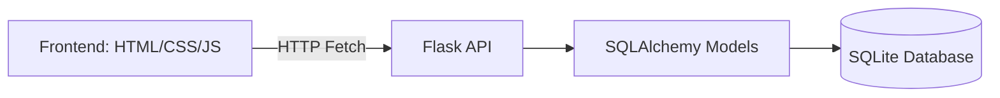

# SASE-STACK

<p align="left">
	
	
	
</p>

## Table of Contents

- [Application Background](#application-background)
- [What Is SASE RIG?](#what-is-sase-rig)
- [Tech Stack](#tech-stack)
- [Core Features](#core-features)
- [Architecture Overview](#architecture-overview)
- [Quick Start (Local Development)](#quick-start-local-development)
- [Team](#team)
- [Project Photo](#project-photo)

## Application Background

SASE-STACK is a full-stack application with:

- A frontend built with HTML/CSS/JavaScript for user interaction
- A Flask backend API for authentication and data operations
- A SQLite database (via SQLAlchemy models) for persistent storage

The app currently supports account creation/login and a dashboard workflow where users can manage categories and entries (title, rating, review, and optional image).

## What Is SASE RIG?

Open to paid members only, SASE Research Interest Group (RIG) was created to give our members experience conducting STEM research. Members work in groups based on their major/interest to produce research projects. Collaboration with faculty members and workshops will be offered.

## Tech Stack

| Layer | Tools |
|---|---|
| Frontend | HTML, CSS, JavaScript |
| Backend | Python, Flask, Flask-CORS |
| ORM / Data | SQLAlchemy |
| Database | SQLite (`backend/User.db`) |
| Security | Werkzeug password hashing |
| Local Frontend Serving | VS Code Live Server (recommended) |

## Core Features

- User sign-up and login flow
- Password hashing for secure credential storage
- Category management (add, edit, delete)
- Entry management inside categories (add, edit, delete)
- Ratings and review tracking per entry
- Basic search and sort behavior in dashboard UI

## Architecture Overview



## Quick Start (Local Development)

### 1. Prerequisites

- Python 3.9+
- VS Code with Live Server extension (or any static file server)

### 2. Install backend dependencies

Run from project root:

```bash
pip install flask flask-cors flask-sqlalchemy sqlalchemy werkzeug
```

### 3. Start the backend

```bash
python backend/flask_server.py
```

Backend runs at `http://127.0.0.1:5000`.

### 4. Start the frontend

- Open `frontend/index.html`
- Run it using Live Server (default `http://127.0.0.1:5500`)

This origin matches the current backend CORS setup.

## Team

### RIG Leader

- Nick Tran

### RIG Mentees

- Kristal Phommalay
- Gurpreet Banwait
- Chris Tran
- Paul Dang
- Alvin Tran
- Tim Garen
- Chris Wu
- Ryan Nguyen
- Peter Tran

## Project Photo

<p align="center">
	
</p>
